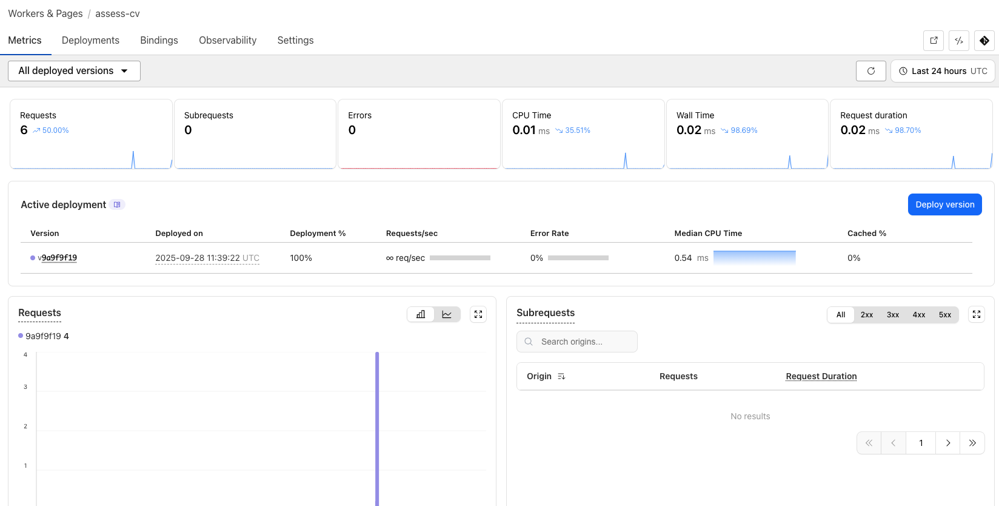

# Recruitment Backend

This is the backend server for the recruitment platform. It handles all business logic, data processing, and coordinates interactions with large language models (LLMs). Built with Python FastAPI, the server is containerized and deployed on AWS EC2, with Nginx used as a reverse proxy to provide secure HTTPS access.

## Technology Stack

- **Backend Framework:** Python FastAPI  
- **Deployment:** AWS EC2  
- **Reverse Proxy:** Nginx (for HTTPS and routing)  
- **Database:** (MySQL)  
- **LLM Integration:** External API or self-hosted LLM services  

## Features

- Robust REST API endpoints to serve frontend requests  
- Business logic for job posting, candidate assessment, and recommendation  
- Integration with AI LLM services for CV scoring and recommendations  
- Secure and scalable deployment with Ec2 and Nginx  
- Database interaction via ORM (e.g., SQLAlchemy)  

## Getting Started

### Prerequisites

- Python 3.10  
- AWS EC2 instance
- Nginx (for reverse proxy configuration)  

### AI Integration 


#### Cloudflare Console




#### llama Prompt

```bash


// Cloudflare Worker - Resume Match Analyzer (returns structured JSON)
// API: POST / with body { jd_text: string, resume_text: string }
export default {
  async fetch(request, env) {
    // 1. CORS Preflight
    if (request.method === "OPTIONS") {
      return new Response(null, {
        headers: corsHeaders(),
      });
    }

    // 2. Only allow POST requests
    if (request.method !== "POST") {
      return json({ error: "Method Not Allowed" }, 405);
    }

    try {
      // 3. Parse JSON body
      const { jd_text, resume_text } = await request.json();

      if (!jd_text || !resume_text) {
        return json({ error: "Missing required fields (jd_text, resume_text)" }, 400);
      }

      // 4. Construct the AI Prompt based on your requirements
      const prompt = `
            You are an experienced technical recruitment expert. Based on the job description (JD) and candidate resume (CV) provided below, please analyze the match between them across multiple dimensions, and output a structured evaluation with detailed scores and actionable suggestions.

            You must return the result in **strictly valid JSON** format (no comments, no extra text, all values must conform to the required types).

            ---

            【Job Description (JD)】
            ${jd_text}

            【Resume (CV)】
            ${resume_text}

            ---

            Please return the result in the **exact** following JSON format (must be valid JSON with no extra content):

            {
              "summary": "Overall evaluation (within 20 characters, indicating how well the candidate matches the JD)",
              "score": {
                "overall": <int: 0-100, total score representing overall fit>,
                "skills_match": <int: 1-100, alignment of technical skills and frameworks>,
                "experience_depth": <int: 1-100, depth and complexity of project experience>,
                "education_match": <int: 1-100, relevance of educational background to the role>,
                "potential_fit": <int: 1-100, potential for growth, willingness to transition, and soft skills alignment>
              },
              "assessment_highlights": [
                "<string: The strongest core skill or project experience that best matches the JD>",
                "<string: Another notable strength in the resume that reflects candidate potential>",
                "<string: A skill or experience that partially matches the JD but could be improved>"
              ],
              "recommendations_for_candidate": [
                "<string: A focused suggestion on how to improve resume presentation or skills based on the JD>",
                "<string: Another specific actionable recommendation to better match the job requirements>",
                "<string: Advice on how to highlight strengths during the interview>"
              ]
            }
            `;

      const aiRes = await env.AI.run("@cf/meta/llama-3.1-8b-instruct", { 
          prompt: prompt,
          // Optional: Add system prompt for better JSON compliance
          system: "You are an expert technical recruiter. Your ONLY output must be a valid, unadorned JSON object that strictly adheres to the user-provided schema. DO NOT add any pre-amble, explanation, or markdown formatting outside of the JSON object itself.",
          max_tokens: 512
      });

      // 6. Extract and validate the JSON response
      const rawText = pickText(aiRes);
      
      if (!rawText) {
        return json({ error: "AI returned empty response", raw: aiRes }, 502);
      }
      
      // Attempt to parse the text as JSON
      let analysisResult;
      try {
          // Clean up potential markdown formatting like ```json ... ```
          const jsonString = rawText.replace(/```json\s*|```\s*/g, '').trim();
          analysisResult = JSON.parse(jsonString);
      } catch (parseErr) {
          console.error("Failed to parse AI response as JSON:", rawText, parseErr);
          // Return the raw text for debugging if parsing fails
          return json({ error: "AI output was not valid JSON", raw_text: rawText }, 502);
      }
      
      // 7. Return the structured JSON result
      return json(analysisResult);
      
    } catch (err) {
      // Handle request/runtime errors
      return json({ error: `Request Error: ${String(err)}` }, 400);
    }
  },
};

function corsHeaders() {
  return {
    "Access-Control-Allow-Origin": "*",
    "Access-Control-Allow-Methods": "POST, OPTIONS",
    "Access-Control-Allow-Headers": "Content-Type",
  };
}

function json(data, status = 200) {
  return new Response(JSON.stringify(data), {
    status,
    headers: {
      "Content-Type": "application/json; charset=utf-8",
      ...corsHeaders(),
    },
  });
}

function pickText(aiRes) {
  if (!aiRes) return "";
  if (typeof aiRes === "string") return aiRes;

  // Common fields
  if (aiRes.response && typeof aiRes.response === "string") return aiRes.response;
  if (aiRes.result && typeof aiRes.result === "string") return aiRes.result;
  if (aiRes.result && typeof aiRes.result.response === "string") return aiRes.result.response;

  // Chat-style responses
  const choiceMsg = aiRes.choices?.[0]?.message?.content;
  if (typeof choiceMsg === "string") return choiceMsg;

  return ""; 
} 
```
### Installation

Clone the repository and install dependencies:

```bash
git clone https://github.com/HanDonoo/recruitment_backend.git
cd recruitment_backend
pip install -r requirements.txt
```
### Running Locally

```bash
uvicorn app.main:app --reload  --port 8080 
```